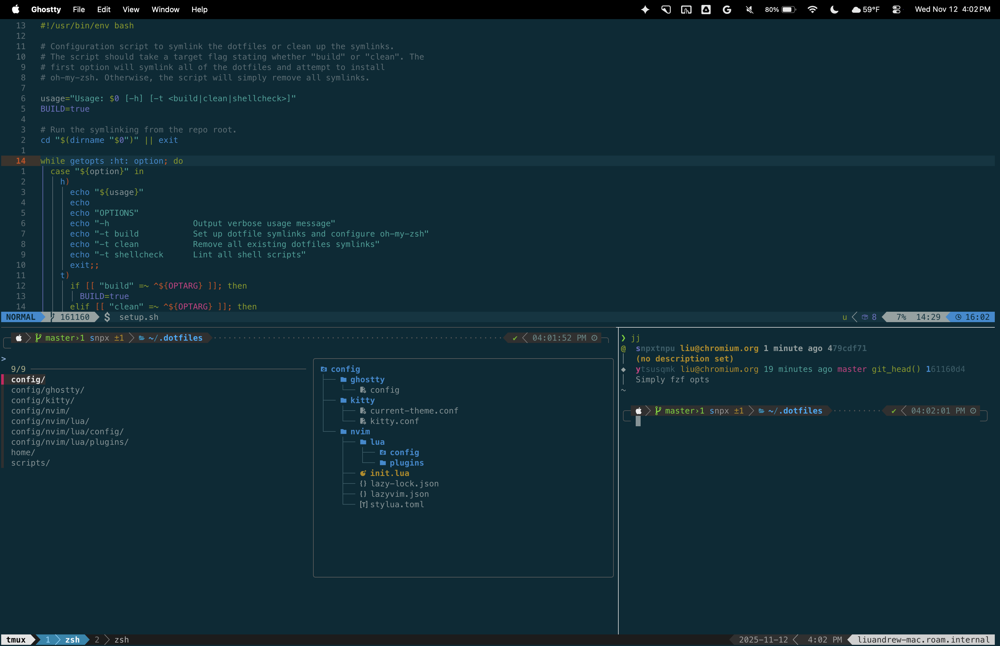

# The Official&trade; MrPickles Dotfiles Repository

These are my personal dotfiles.

```
curl -L andrew.cloud/dotfiles.sh | bash
```



These dotfiles are intended for use with zsh, [oh-my-zsh][], and the
[solarized][] colorscheme.
The configuration uses powerline-based status bars for vim and tmux and
[Powerlevel10k][powerlevel10k] as its zsh theme.

## Try it out in Docker

These dotfiles are available as a [Docker image][docker-hub].
It's the easiest way to emulate the development environment that I normally use.
To spin up a new container, install Docker and run the command below.

```shell
docker run -it docker.io/liuandrewk/dotfiles
```

You should also make sure to have Powerline fonts available in your terminal.
It'll otherwise work out of the box.

## Prerequisites

These dotfiles contain the following software dependencies:

* Linux, MacOS, or WSL
* Neovim (latest stable version)

## Installation

Installation is as simple as downloading and running the install script.
The install script will run the configuration script, which fetches oh-my-zsh
and symlinks the dotfiles to your home directory.

```shell
curl -L andrew.cloud/dotfiles.sh | bash
# or
wget -qO- andrew.cloud/dotfiles.sh | bash
# or
curl https://raw.githubusercontent.com/MrPickles/dotfiles/master/scripts/dotfiles.sh | bash
```

Alternatively, you can manually clone the repository and run the `setup.sh`
script.

```shell
git clone --filter=blob:none git@github.com:MrPickles/dotfiles.git ~/.dotfiles
cd ~/.dotfiles
./setup.sh
```

You will also likely need to manually change your shell to `zsh` if you are
currently using a different shell.

```shell
chsh -s $(which zsh)
```

For future runs, if you ever want to update custom plugins or redo the symlinks,
you can run the setup script with the following flags:

```shell
./setup.sh -t build
```

## Setting up your Local Machine

Your local machine will require configurations that need to be done at most
once.
If you use [Kitty][kitty] as your terminal, there should be no configuration
needed, in theory.
Specifically, these relate to fonts and the color scheme.

- Currently, I use `MesloLGS NF` as my regular font.
  Follow the [Powerlevel10k font instructions][p10k-fonts] to install the proper
  fonts.
- I use [Solarized Dark][solarized].
  Different terminals have different configuration steps needed.

### Other optional tools

There are a few recommended (but optional) tools you can install to improve your
shell experience in general.

* [bat](https://github.com/sharkdp/bat)
* [ripgrep](https://github.com/BurntSushi/ripgrep)
* [fd](https://github.com/sharkdp/fd)
* [eza](https://github.com/eza-community/eza)
* [fzf](https://github.com/junegunn/fzf)
* [delta](https://github.com/dandavison/delta)

The configuration script attempts to install these, but if you do not have sudo
access, it may not work.

## Customizing

You can customize zsh, vim, tmux, and git for each specific machine.
Just put any additional configurations in the following files:

* `~/.zshrc.local`
* `~/.vimrc.local`
* `~/.tmux.conf.local`

Custom git configurations can be placed in `~/.gitconfig`.
The normal git config file is not put under version control, so it's safe to put
machine-specific tokens in it.

## Docker

If you'd like to build the dotfiles as a Docker image locally, run the following
command:

```shell
docker build -t liuandrewk/dotfiles .
```

Then you can run it with the command below:

```shell
docker run -it liuandrewk/dotfiles
```

Note that this will be an ephemeral instance. Make sure to mount a volume if
you'd like to persist your work.

## Teardown

To clean up the dotfiles, run the configuration script with the `clean`
argument.
It will remove all symlinks, but zsh and oh-my-zsh will be untouched.
If you wish to remove those, you will have to manually delete them.

```shell
cd ~/.dotfiles
./setup.sh -t clean
rm -rf ~/.oh-my-zsh # optionally remove oh-my-zsh
chsh -s $(which bash) # optionally change shell back to bash
```

[solarized]: http://ethanschoonover.com/solarized
[oh-my-zsh]: https://github.com/robbyrussell/oh-my-zsh
[p10k-fonts]: https://github.com/romkatv/powerlevel10k/#meslo-nerd-font-patched-for-powerlevel10k
[powerlevel10k]: https://github.com/romkatv/powerlevel10k
[docker-hub]: https://hub.docker.com/r/liuandrewk/dotfiles
[kitty]: https://sw.kovidgoyal.net/kitty/
