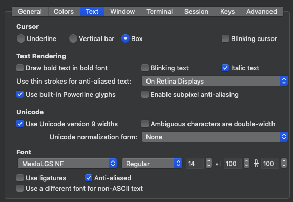

# Andrew's Dotfiles

These are my personal dotfiles.

These dotfiles are best used with zsh, [oh-my-zsh][oh-my-zsh], and the
[solarized][solarized] colorscheme.
The configuration has powerline-based fonts status bars for vim and tmux, and
uses [Powerlevel10k][powerlevel10k] as its zsh theme.
Thus you'll need to patch to a font that supports powerline and Font Awesome
symbols.

## Prequisites

These dotfiles contain the following software dependencies:

* Linux or MacOS
* Vim 8.0+

There currently is no Windows support.
However, MacOS and most flavors of Linux should work fine.
These dotfiles use Vim's new [native package manager][vim8] in order to
distribute modules in an organized fashion, so versions of Vim before 8 will not
function properly.

## Setting up your Local Machine

_[Go to the next section](#installation) if you have already configured these
dotfiles on your machine once, or if you are SSHing into another machine.
These setup instructions only need to be done once on a local machine._

New machines require two tasks to be done which are not part of the setup
script:

* installing (and using) Powerline/Font Awesome-compatible fonts, and
* using the Solarized colorscheme.

### MacOS

#### Installing Powerline/Font Awesome Fonts

The terminal prompt uses characters from [Powerline][powerline] and
[Font Awesome][awesome-terminal-fonts].
Fortunately, we have a pre-patched font that contains all the necessary symbols.

1. Install the file at
   `third_party/awesome-terminal-fonts/patched/Droid+Sans+Mono+Awesome.ttf`.
   Clicking on the file from Finder should be sufficient.
2. Go to the `Text` tab in your current iTerm profile and select the option to
   `Use a different font for non-ASCII text`.
3. In the same tab, select `Droid Sans Mono Awesome` as the font for non-ASCII
   text.

To patch your own fonts or configure the symbols for all other fonts, you can
take a look at the [Mac installation instructions][fa-mac] for Font Awesome, or
read the [wiki][fa-mac-wiki].
Do note that the setup is much more involved than just using a pre-patched font.

The Powerline symbols included in the font might not align well.
As a remedy, iTerm has a `Use built-in Powerline glyphs` option to substitute
the characters with its own built-in alternative characters.
I'd recommend checking that option.

The Text section of my iTerm settings looks like the picture below.
For ASCII text, I use `Menlo Regular` (which is a native font) and use 14pt for
all font types.



#### Solarized on iTerm

The Solarized colors for iTerm can be found in its
[official repository][solarized-repo].
Import [`Solarized Dark.itermcolors`][itermcolors] as a colorscheme for iTerm.
In the `Colors` section of your iTerm profile, use the `Solarized Dark` preset.

#### Enable Copy/Paste in Tmux

On Macs, `pbcopy` and `pbpaste` don't natively work in tmux.
Luckly there's a [Homebrew][homebrew] formula to fix that.

```shell
brew install reattach-to-user-namespace
```

The tmux configuration will do the rest for you.
Note that this only applies to machines running MacOS.

#### Enable Mouse Wheel Scrolling in Vim on iTerm

If using iTerm, setting `Scroll wheel sends arrow keys when in alternate screen
mode.` to `Yes` will allow trackpad scrolling while in Vim.
The setting can be found in the advanced preferences.

### Linux

#### Patching the Font to be Powerline-compatible

In Linux machines, you need to patch the current font to support
[Powerline][powerline] characters.
You need [10-powerline-symbols.conf][symbols-conf] and
[PowerlineSymbols.otf][symbols-otf].
Follow the commands below to patch the font.

```shell
mkdir -p ~/.fonts/ && cd ~/.fonts/
wget https://raw.githubusercontent.com/powerline/powerline/master/font/PowerlineSymbols.otf
mkdir -p ~/.config/fontconfig/conf.d && cd ~/.config/fontconfig/conf.d
fc-cache -vf ~/.fonts/
wget https://raw.githubusercontent.com/powerline/powerline/master/font/10-powerline-symbols.conf
```

#### Patching the Font to be Font Awesome-compatible

You may need to do some [additional patching][fa-linux] for Font Awesome.
The instructions are in the link from the previous sentence, but your commands
will end up looking something like what's below.
Make sure that the symbols aren't already available out of the box before trying
any patching.

```shell
mkdir -p ~/.fonts/ && mkdir -p ~/.config/fontconfig/conf.d
cp third_party/awesome-terminal-fonts/build/*.ttf ~/.fonts/
cp third_party/awesome-terminal-fonts/build/*.sh ~/.fonts/
fc-cache -vf ~/.fonts/
# Edit 10-symbols.conf with your desired font.
cp third_party/awesome-terminal-fonts/config/10-symbols.conf ~/.config/fontconfig/conf.d
source ~/.fonts/*.sh
```

#### Solarized on Ubuntu Terminal

To get Solarized on the Ubuntu Terminal, you will want to create a new profile.
Then you will follow the instructions in
[gnome-terminal-colors-solarized][gnome-terminal-colors-solarized] to set the
color scheme.

Start by creating a new profile on the terminal emulator.


Set that profile to be the default profile upon terminal open.


Finally clone the
[gnome-terminal-colors-solarized repo][gnome-terminal-colors-solarized] and
follow its installation instructions.

```shell
git clone https://github.com/Anthony25/gnome-terminal-colors-solarized.git
cd gnome-terminal-colors-solarized
./set_dark.sh
```

### Other optional tools

There are a few recommended (but optional) tools you can install to improve your
shell experience in general.

* [`diff-so-fancy`][diff-so-fancy]: Diff-so-fancy is a diffing tool that gives a
  nicer diff than the git default.
* [`rg`][rg]: Ripgrep is a faster alternative over `ag`, `ack`, and `grep`.
  It has the exact same usage as `ag` and is likely more preferable in all use
  cases.
* [`fzf`][fzf]: Fzf is a general purpose fuzzy funder.
* [`fd`][fd]: `fd` is a faster alternative to the `find` command.
  It works very well when paired with `fzf`.
* `tree`: This will display the directory structure as a tree. We use it to
  improve the output of `ALT-C` from `fzf`.
* [`highlight`][highlight]: This adds coloring to output. We also use it to
  improve the output of `CTRL-T` from `fzf`.

You should install all of these independently of this dotfile repo.
(This also includes figuring out how to install them.)
Most of these are Homebrew packages on MacOS (or a target in most Linux package
managers).

## Installation

Installation is as simple as downloading and running the install script.
The install script will run the configuration script, which fetches oh-my-zsh
and symlinks the dotfiles to your home directory.

```shell
curl -sL https://raw.githubusercontent.com/MrPickles/dotfiles/master/install.sh | sh
```

Alternatively, you can manually clone the repository and run the `configure.sh`
script.

```shell
git clone --depth=1 git@github.com:MrPickles/dotfiles.git ~/.dotfiles
cd ~/.dotfiles
./configure.sh -t build
```

You will also likely need to manually change your shell to `zsh` if you are
currently using a different shell.

```shell
chsh -s $(which zsh)
```

## Customizing

You can customize vim, git, tmux, and zsh for each specific machine.
Just put any additional configurations in `~/.zshrc.local`, `~/.tmux.conf.local`
`~/.gitconfig.local` or `~/.vimrc.local`.
Sample local configs are included in this repo.
Custom git configurations can also be placed in `.gitconfig`.

## Teardown

To clean up the dotfiles, run the configuration script with the `clean`
argument.
It will remove all symlinks, but zsh and oh-my-zsh will be untouched.
If you wish to remove those, you will have to manually delete them.

```shell
cd ~/.dotfiles
./configure.sh -t clean
rm -rf ~/.oh-my-zsh # optionally remove oh-my-zsh
chsh -s $(which bash) # optionally change shell back to bash
```

[solarized]: <http://ethanschoonover.com/solarized>
[homebrew]: <http://brew.sh/>
[vim8]: <https://github.com/vim/vim/blob/753289f9bf71c0528f00d803a39d017184640e9d/runtime/doc/version8.txt>

[oh-my-zsh]: <https://github.com/robbyrussell/oh-my-zsh>
[diff-so-fancy]: <https://github.com/so-fancy/diff-so-fancy>
[powerline-fonts]: <https://github.com/powerline/fonts>
[awesome-terminal-fonts]: <https://github.com/gabrielelana/awesome-terminal-fonts>
[gnome-terminal-colors-solarized]: <https://github.com/Anthony25/gnome-terminal-colors-solarized>
[powerline]: <https://github.com/powerline/powerline>
[solarized-repo]: <https://github.com/altercation/solarized>
[rg]: <https://github.com/BurntSushi/ripgrep>
[fd]: <https://github.com/sharkdp/fd>
[fzf]: <https://github.com/junegunn/fzf>
[highlight]: <http://www.andre-simon.de/doku/highlight/en/highlight.html>

[itermcolors]: <https://raw.githubusercontent.com/altercation/solarized/e40cd4130e2a82f9b03ada1ca378b7701b1a9110/iterm2-colors-solarized/Solarized%20Dark.itermcolors>
[symbols-conf]: <https://raw.githubusercontent.com/powerline/powerline/5a24eceae9b61b89b34794fea18b8c51da823a6c/font/10-powerline-symbols.conf>
[symbols-otf]: <https://raw.githubusercontent.com/powerline/powerline/5a24eceae9b61b89b34794fea18b8c51da823a6c/font/PowerlineSymbols.otf>

[powerlevel10k]: <https://github.com/romkatv/powerlevel10k>
[fa-mac]: <https://github.com/gabrielelana/awesome-terminal-fonts#how-to-install-osx>
[fa-mac-wiki]: <https://github.com/gabrielelana/awesome-terminal-fonts/wiki/OS-X>
[fa-linux]: <https://github.com/gabrielelana/awesome-terminal-fonts#how-to-install-linux>
