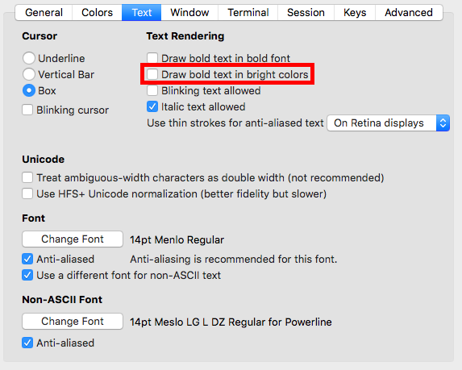
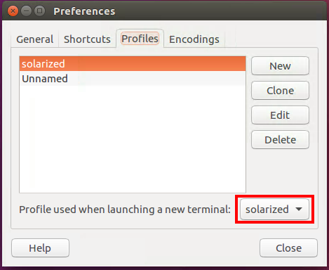

# Andrew's Dotfiles

These are my personal dotfiles.

These dotfiles are best used with zsh, [oh-my-zsh][oh-my-zsh], and the
[solarized][solarized] colorscheme.
The configuration has powerline-based fonts status bars for vim and tmux, and
uses a [Powerlevel10k][powerlevel10k] as its zsh theme.
Thus you'll need to patch to a font that supports powerline and font-awesome
symbols.

## Prequisites

These dotfies contain the following software dependencies:
* Linux or MacOS
* Vim 8.0+
* Perl 5.8+ (optional)

There currently is no Windows support.
However MacOS and most flavors of Linux should work fine.
These dotfiles use Vim's new [native package manager][vim8] in order to
distribute modules in an organized fashion, so versions of Vim before 8 will not
function properly.
You will need Perl in order to run [diff-so-fancy][diff-so-fancy].
However, this is optional, and you can use the normal diffing tool instead.

## Setting up your Local Machine

*[Go to the next section](#installation) if you have already configured these
dotfiles on your machine once, or if you are SSHing into another machine.
These setup instructions only need to be done once on a local machine.*

New machines require two tasks to be done which are not part of the setup
script: installing (and using) Powerline-compatible fonts and using the
Solarized colorscheme.
This configuration uses a zsh theme similar to Agnoster.
It also uses Powerline for vim and tmux.
As a result, you'll need to install patched fonts that support Powerline.

### MacOS

#### Installing Powerline-compatible Fonts

To install fonts on your Mac go to the Powerline
[fonts repository][powerline-fonts] and follow the installation instructions.

To install Font Awesome symbols, follow the instructions found in the [Awesome
Terminal Fonts][awesome-terminal-fonts] repository.

Next you will want to change the fonts in your iTerm profile.
Go to the `Text` tab in your current profile and pick an appropriate font.

#### Solarized on iTerm

The Solarized colors for iTerm can be found in its
[official repository][solarized-repo].
Import [`Solarized Dark.itermcolors`][itermcolors] as a colorscheme for iTerm.
In the `Colors` section of your iTerm profile, use the `Solarized Dark` preset.
To get the directory colors to work, you'll need to uncheck the `Draw bold text
in bright colors` setting.



#### Enable Copy/Paste in Tmux

On Macs, `pbcopy` and `pbpaste` don't natively work in tmux.
Luckly there's a [Homebrew][homebrew] formula to fix that.

```bash
brew install reattach-to-user-namespace
```

The tmux configuration will do the rest for you.
Note that this only applies to machines running MacOS.

#### Enable Mouse Wheel Scrolling in Vim on iTerm

If using iTerm, setting `Scroll wheel sends arrow keys when in alternate screen
mode.` to `Yes` will allow trackpad scrolling while in Vim.
The setting can be found in the advanced preferences.

### Linux

#### Patching the Font to be Powerline-compatible

In Linux machines, you need to patch the current font to support
[Powerline][powerline] characters.
You need [10-powerline-symbols.conf][symbols-conf] and
[PowerlineSymbols.otf][symbols-otf].
Follow the commands below to patch the font.

```bash
mkdir -p ~/.fonts/ && cd ~/.fonts/
wget https://raw.githubusercontent.com/powerline/powerline/master/font/PowerlineSymbols.otf
mkdir -p ~/.config/fontconfig/conf.d && cd ~/.config/fontconfig/conf.d
fc-cache -vf ~/.fonts/
wget https://raw.githubusercontent.com/powerline/powerline/master/font/10-powerline-symbols.conf
```

#### Solarized on Ubuntu Terminal

To get Solarized on the Ubuntu Terminal, you will want to create a new profile.
Then you will follow the instructions in
[gnome-terminal-colors-solarized][gnome-terminal-colors-solarized] to set the
color scheme.

Start by creating a new profile on the terminal emulator.


Set that profile to be the default profile upon terminal open.



Finally clone the
[gnome-terminal-colors-solarized repo][gnome-terminal-colors-solarized] and
follow its installation instructions.

```bash
git clone https://github.com/Anthony25/gnome-terminal-colors-solarized.git
cd gnome-terminal-colors-solarized
./set_dark.sh
```

### Other optional tools

There are a few recommended (but optional) tools you can install to improve your
shell experience in general.

* [`diff-so-fancy`][diff-so-fancy]: Diff-so-fancy is a diffing tool that gives a
  nicer diff than the git default.
* [`rg`][rg]: Ripgrep is a faster alternative over `ag`, `ack`, and `grep`.
  It has the exact same usage as `ag` and is likely more preferable in all use
  cases.
* [`fzf`][fzf]: Fzf is a general purpose fuzzy funder.
* [`fd`][fd]: `fd` is a faster alternative to the `find` command.
  It works very well when paired with `fzf`.
* `tree`: This will display the directory structure as a tree. We use it to
  improve the output of `ALT-C` from `fzf`.
* [`highlight`][highlight]: This adds coloring to output. We also use it to
  improve the output of `CTRL-T` from `fzf`.

You should install all of these independently of this dotfile repo.
(This also includes figuring out how to install them.)
Most of these are Homebrew packages on MacOS (or a target in most Linux package
managers).

## Installation

Installation is as simple as downloading and running the install script.
The install script will run the configuration script, which fetches oh-my-zsh
and symlinks the dotfiles to your home directory.

```bash
curl -sL https://raw.githubusercontent.com/MrPickles/dotfiles/master/install.sh | sh
```

Alternatively, you can manually clone the repository and run the `configure.sh`
script.

```bash
git clone --depth=1 git@github.com:MrPickles/dotfiles.git ~/.dotfiles
cd ~/.dotfiles
./configure.sh -t build
```

You will also likely need to manually change your shell to `zsh` if you are
currently using a different shell.

```bash
chsh -s $(which zsh)
```

## Customizing

You can customize vim, git, tmux, and zsh for each specific machine.
Just put any additional configurations in `~/.zshrc.local`, `~/.tmux.conf.local`
`~/.gitconfig.local` or `~/.vimrc.local`.
Sample local configs are included in this repo.
Custom git configurations can also be placed in `.gitconfig`.

With oh-my-zsh, you can also include zsh themes.
I've included my own [custom theme](themes/pickles.zsh-theme) by default.
You can read more about it in the [README](themes/README.md) in the `themes/`
directory.
I now use the [Powerlevel10k][powerlevel10k] theme, but you can still use the
custom theme as a fallback option in case there are any issues installing Font
Awesome symbols.

## Teardown

To clean up the dotfiles, run the configuration script with the `clean`
argument.
It will remove all symlinks, but zsh and oh-my-zsh will be untouched.
If you wish to remove those, you will have to manually delete them.

```bash
cd ~/.dotfiles
./configure.sh -t clean
rm -rf ~/.oh-my-zsh # optionally remove oh-my-zsh
chsh -s `which bash` # optionally change shell back to bash
```

[solarized]: <http://ethanschoonover.com/solarized>
[homebrew]: <http://brew.sh/>
[vim8]: <https://github.com/vim/vim/blob/753289f9bf71c0528f00d803a39d017184640e9d/runtime/doc/version8.txt>

[oh-my-zsh]: <https://github.com/robbyrussell/oh-my-zsh>
[diff-so-fancy]: <https://github.com/so-fancy/diff-so-fancy>
[powerline-fonts]: <https://github.com/powerline/fonts>
[awesome-terminal-fonts]: <https://github.com/gabrielelana/awesome-terminal-fonts>
[gnome-terminal-colors-solarized]: <https://github.com/Anthony25/gnome-terminal-colors-solarized>
[powerline]: <https://github.com/powerline/powerline>
[solarized-repo]: <https://github.com/altercation/solarized>
[rg]: <https://github.com/BurntSushi/ripgrep>
[fd]: <https://github.com/sharkdp/fd>
[fzf]: <https://github.com/junegunn/fzf>
[highlight]: <http://www.andre-simon.de/doku/highlight/en/highlight.html>

[itermcolors]: <https://raw.githubusercontent.com/altercation/solarized/e40cd4130e2a82f9b03ada1ca378b7701b1a9110/iterm2-colors-solarized/Solarized%20Dark.itermcolors>
[symbols-conf]: <https://raw.githubusercontent.com/powerline/powerline/5a24eceae9b61b89b34794fea18b8c51da823a6c/font/10-powerline-symbols.conf>
[symbols-otf]: <https://raw.githubusercontent.com/powerline/powerline/5a24eceae9b61b89b34794fea18b8c51da823a6c/font/PowerlineSymbols.otf>

[powerlevel10k]: <https://github.com/romkatv/powerlevel10k>
