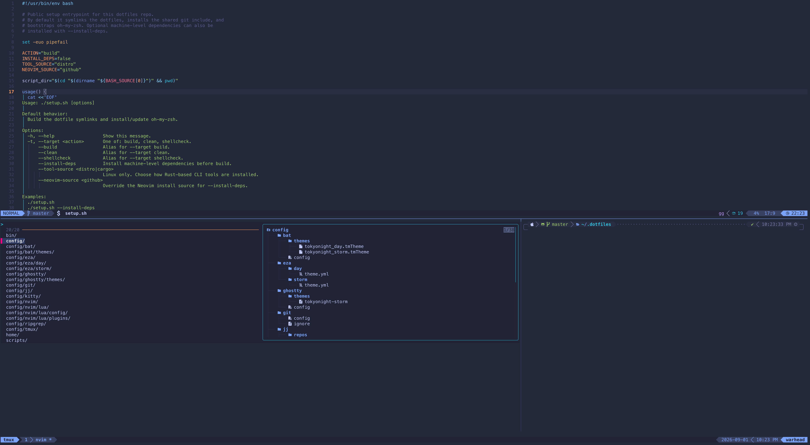

# The Official&trade; MrPickles Dotfiles Repository

These are my personal dotfiles.

```
curl https://raw.githubusercontent.com/MrPickles/dotfiles/master/scripts/dotfiles.sh | bash
```



These dotfiles are intended for use with zsh, [oh-my-zsh][], and the
[Tokyo Night][tokyonight] colorscheme.
The screenshot above predates this change.
The configuration uses powerline-based status bars for vim and tmux and
[Powerlevel10k][powerlevel10k] as its zsh theme.

## Try it out in Docker

These dotfiles are available as a [Docker image][docker-hub].
It's the easiest way to emulate the development environment that I normally use.
To spin up a new container, install Docker and run the command below.

```shell
docker run -it docker.io/liuandrewk/dotfiles
```

You should also make sure to have Powerline fonts available in your terminal.
It'll otherwise work out of the box.

## Prerequisites

These dotfiles contain the following software dependencies:

* Linux, MacOS, or WSL
* Neovim (latest stable version)
* [tree-sitter-cli](https://github.com/tree-sitter/tree-sitter) (required for Neovim's parsing engine)

## Installation

Installation is as simple as downloading and running the install script.
The install script will run the configuration script, which fetches oh-my-zsh
and symlinks the dotfiles to your home directory.

```shell
curl https://raw.githubusercontent.com/MrPickles/dotfiles/master/scripts/dotfiles.sh | bash
```

Alternatively, you can manually clone the repository and run the `setup.sh`
script.

```shell
git clone --filter=blob:none git@github.com:MrPickles/dotfiles.git ~/.dotfiles
cd ~/.dotfiles
./setup.sh
```

On a fresh machine, you can ask `setup.sh` to install the system-level
dependencies first:

```shell
./setup.sh --install-deps
```

You will also likely need to manually change your shell to `zsh` if you are
currently using a different shell.

```shell
chsh -s $(which zsh)
```

For future runs, if you ever want to update custom plugins or redo the symlinks,
you can run the setup script again:

```shell
./setup.sh
```

On systems with Homebrew, the setup also installs a `brew sync` command that
updates Homebrew, upgrades installed packages without a confirmation prompt,
and removes stale package versions and cached artifacts:

```shell
brew sync
```

On Linux, `setup.sh` can also override the dependency install strategy:

```shell
./setup.sh --install-deps --tool-source distro
./setup.sh --install-deps --tool-source cargo
```

By default, Linux uses a release-aware mix of distro packages and upstream
artifacts where the distro version is missing or too old. Cargo remains
available as an explicit override for the Rust-based CLI tools.

### Neovim language servers

LazyVim uses [Mason][] to install language servers and formatter/linter tools.
Mason installs each tool through that tool's native package ecosystem, so some
Neovim features depend on extra system runtimes beyond Neovim itself.

For example, the Python LazyVim extra enables Pyright and Ruff by default:

- Pyright is distributed as an npm package, so Mason needs `node` and `npm` to
  install `pyright-langserver`.
- Ruff is distributed on PyPI, so Mason creates a private Python virtualenv for
  it. On Debian and Ubuntu, that requires the `python3-venv` package; plain
  `python3` is not enough.

If Mason cannot install one of these tools, Neovim may still work when the
command is already available globally on `PATH`, but fresh-machine setup is more
reliable when the underlying runtimes are installed first.

## Setting up your Local Machine

Your local machine will require configurations that need to be done at most
once.
If you use [Kitty][kitty] as your terminal, there should be no configuration
needed, in theory.
Specifically, these relate to fonts and the color scheme.

- Currently, I use `MesloLGS NF` as my regular font.
  Follow the [Powerlevel10k font instructions][p10k-fonts] to install the proper
  fonts.
- Ghostty, Kitty, and tmux use Tokyo Night Storm. Neovim, bat, eza, delta,
  fzf, and Powerlevel10k follow the terminal (Storm or Day). Fallback Vim and
  zsh syntax highlighting keep the terminal palette.
- Setup rebuilds bat's theme cache (also used by delta). If bat is installed later
  or its themes are updated, run `bat cache --build` (`batcat` on some Linux systems).
- After changing themes, reload the terminal configuration and open a new shell.
  Restart Neovim to load the selected colorscheme. Reload tmux with `prefix r`.

Vendored Storm and Day extras are copies from
[folke/tokyonight.nvim][tokyonight] at
`5da1b76e64daf4c5d410f06bcb6b9cb640da7dfd`, matching the revision in
`config/nvim/lazy-lock.json` when they were imported. Each file notes its
upstream path; palette values are otherwise unchanged. They are not an automatic
update path; keep theme refreshes separate from routine upgrades. Neovim's
plugin is updated by Lazy. The extras are Apache-2.0; this repo remains MIT.

| Local file | Upstream extra |
| --- | --- |
| `config/ghostty/themes/tokyonight-storm` | `extras/ghostty/tokyonight_storm` |
| `config/kitty/current-theme.conf` | `extras/kitty/tokyonight_storm.conf` |
| `config/eza/storm/theme.yml` | `extras/eza/tokyonight_storm.yml` |
| `config/eza/day/theme.yml` | `extras/eza/tokyonight_day.yml` |
| `config/bat/themes/tokyonight_storm.tmTheme` | `extras/sublime/tokyonight_storm.tmTheme` |
| `config/bat/themes/tokyonight_day.tmTheme` | `extras/sublime/tokyonight_day.tmTheme` |
| `config/tmux/tokyonight_storm.tmux` | `extras/tmux/tokyonight_storm.tmux` |

Interactive shells query the terminal background (OSC 11) and set
`DOTFILES_COLOR_MODE` (`light` or `dark`; override by exporting it first).
Inside tmux the query is skipped and the mode stays dark.
That selects bat's theme, eza's config dir, delta's feature, fzf colors, and
the Powerlevel10k palette. fzf `--color` options live in `home/zshrc`. Delta
features are in `config/git/config`. To refresh, copy the same paths from one
reviewed revision, replace the fzf arrays and delta styles, update this table,
and run `bat cache --build`.

### Other optional tools

There are a few recommended (but optional) tools you can install to improve your
shell experience in general.

* [bat](https://github.com/sharkdp/bat)
* [ripgrep](https://github.com/BurntSushi/ripgrep)
* [fd](https://github.com/sharkdp/fd)
* [eza](https://github.com/eza-community/eza)
* [fzf](https://github.com/junegunn/fzf)
* [delta](https://github.com/dandavison/delta)

These can be installed via `./setup.sh --install-deps`. On Linux, the shared
installer auto-detects the distro release and prefers distro-managed packages
when they are recent enough, falling back to upstream installs when needed.
Cargo remains available as an override for the Rust-based CLI tools. If you do
not have sudo access, distro-managed installs may not work.

## Customizing

You can customize zsh, vim, tmux, and git for each specific machine.
Just put any additional configurations in the following files:

* `~/.zshenv.local`
* `~/.zshrc.local`
* `~/.vimrc.local`
* `~/.tmux.conf.local`

Custom git configurations can be placed in `~/.gitconfig`.
The shared git config is stored in `config/git/config` and is automatically
included by the setup script, so it's safe to put machine-specific tokens in
the normal `~/.gitconfig` since it's not put under version control.

Jujutsu (`jj`) uses a similar strategy natively:
The shared configuration is stored in `config/jj/config.toml`. You can securely
place any machine-specific or private configurations in `~/.jjconfig.toml`.
(Unlike Git, Jujutsu natively merges both configurations automatically, so no
explicit `include` statements are required.)

## Docker

If you'd like to build the dotfiles as a Docker image locally, run the following
command:

```shell
docker build -t liuandrewk/dotfiles .
```

Then you can run it with the command below:

```shell
docker run -it liuandrewk/dotfiles
```

Note that this will be an ephemeral instance. Make sure to mount a volume if
you'd like to persist your work.

## Teardown

To clean up the dotfiles, run the configuration script with the `clean`
argument.
It will remove all symlinks, but zsh and oh-my-zsh will be untouched.
If you wish to remove those, you will have to manually delete them.

```shell
cd ~/.dotfiles
./setup.sh --clean
rm -rf ~/.oh-my-zsh # optionally remove oh-my-zsh
chsh -s $(which bash) # optionally change shell back to bash
```

[tokyonight]: https://github.com/folke/tokyonight.nvim
[oh-my-zsh]: https://github.com/robbyrussell/oh-my-zsh
[p10k-fonts]: https://github.com/romkatv/powerlevel10k/#meslo-nerd-font-patched-for-powerlevel10k
[powerlevel10k]: https://github.com/romkatv/powerlevel10k
[docker-hub]: https://hub.docker.com/r/liuandrewk/dotfiles
[kitty]: https://sw.kovidgoyal.net/kitty/
[Mason]: https://github.com/mason-org/mason.nvim
