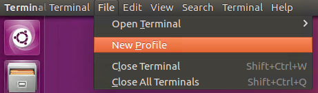
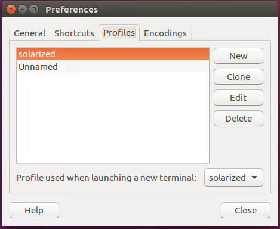

# Provisioning a New Machine

After you clone the repository and run the setup script, there were will be a
few steps left when configuring a new machine.

## Switch default shell to ZSH

The setup script doesn't change your default shell. You'll have to do that
manually.

`chsh -s $(which zsh)`

## Install Powerline Fonts

This configuration uses a zsh theme similar to Agnoster. It also uses Powerline
for vim and tmux. As a result, you'll need to install patched fonts that support
Powerline.

### Font installation on Linux

```bash
cd ~/.dotfiles/new_machine
mkdir -p ~/.fonts/
cp PowerlineSymbols.otf ~/.fonts/
mkdir -p ~/.config/fontconfig/conf.d
fc-cache -vf ~/.fonts/
cp 10-powerline-symbols.conf ~/.config/fontconfig/conf.d
```

## Install Solarized

The dotfiles are best used with the solarized dark solorscheme.

### Solarized on Linux

0. Create a new profile on the terminal emulator.

  

0. Set that profile to be the default profile upon terminal open.

  

0. Run the setup script for solarized.

  ```bash
  cd ~/.dotfiles/new_machine/gnome-terminal-colors-solarized
  ./set_dark.sh
  ```

## Enable Copy/Paste in Tmux on OSX
On Macs, `pbcopy` and `pbpaste` don't natively work in tmux. Luckly there's a
[Homebrew](http://brew.sh/) formula to fix that.

```bash
brew install reattach-to-user-namespace
```

The tmux configuration will do the rest for you. Note that this only applies to
machines running OSX.

