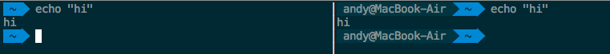
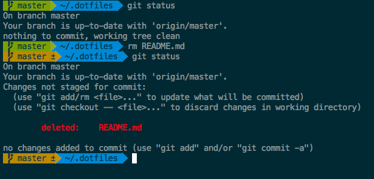
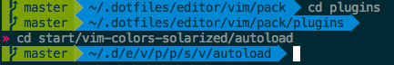

# pickles.zsh-theme

This is my custom zsh theme. It's based off the
[Agnoster](https://github.com/agnoster/agnoster-zsh-theme) theme with a few
cosmetic tweaks. In order for this theme to render correctly, you'll need to
have powerline-patched fonts.

## Hiding User and Hostname

You can opt to hide your user and hostname when in local sessions in order to
avoid clutter on the terminal. To do so, simply set the `DEFAULT_USER`
environment variable to be your username. Remember that this is disabled in SSH
sessions.

## Git Status at Prompt

If you are in a git repository, you will be able to see the status of the repo.
The prompt will be green for a clean `HEAD`, and it will be yellow if the state
is dirty.

## Prompt Abbreviation and Resets

To further avoid clutter in the terminal, this theme dynamically adjusts the
prompt based off its length. If the length of the current working directory is
longer than 45 characters, the prompt will shorten the directory using fish
shell directory abbreviations. If the entirety of the resultant prompt is over
100 characters, the prompt will finish on the next line, so you don't have to
start typing near the edge of the screen.
